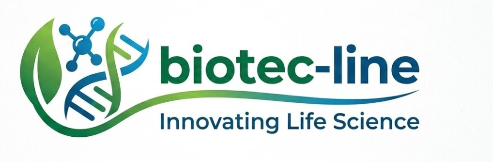

  

# biotec-line

**Local-first bioinformatics tools for DTC DNA conversion, VCF/gVCF processing, genetic variant annotation, and research-grade desktop workflows.**

biotec-line builds practical Python desktop software for working with sensitive genetic files on the user's own machine. The current projects focus on converting direct-to-consumer DNA exports into VCF 4.2, validating genome builds, annotating VCF/gVCF data, filtering variants, and exporting research-oriented results without turning genetic data into a cloud workflow.

## Start Here

| Need | Start with | Why |
|---|---|---|
| Convert 23andMe, MyHeritage, FTDNA, or similar raw DNA exports to VCF 4.2 | [genotype-to-vcf](https://github.com/biotec-line/genotype-to-vcf) | PySide6 desktop converter with GRCh37/GRCh38 detection, dbSNP/FASTA reference lookup, local cache, and privacy-focused VCF output |
| Annotate, filter, inspect, and export VCF/gVCF or 23andMe-derived variant files | [VFDistiller](https://github.com/biotec-line/VFDistiller) | Windows-first variant analysis GUI with gnomAD, MyVariant.info, VEP, ALFA, TOPMed, ClinVar-oriented fields, FASTA validation, and CSV/Excel/PDF/VCF export |

## Project Families

### Genotype Conversion

| Project | Description |
|---|---|
| [genotype-to-vcf](https://github.com/biotec-line/genotype-to-vcf) | Converts four-column DTC DNA raw data into VCF 4.2 with automatic build detection, sex-aware ploidy handling, dbSNP integration, optional offline FASTA lookup, and local-only file handling |

### Variant Processing And Annotation

| Project | Description |
|---|---|
| [VFDistiller](https://github.com/biotec-line/VFDistiller) | Local-first desktop app for VCF, gVCF, 23andMe raw text, and FASTA workflows, including annotation, filtering, allele-frequency lookup, reference validation, and research exports |

## Research Use Boundary

These tools are built for bioinformatics research, teaching, software development, and reproducible local workflows. They are **not medical devices**, **not in-vitro diagnostic products**, **not clinically validated**, and **not intended for diagnosis, prognosis, therapy decisions, or clinical interpretation of genetic results**.

Users remain responsible for lawful handling of genetic data, informed consent, data minimization, local storage security, and interpretation by qualified professionals where health-related questions are involved.

## Design Principles

- **Local first:** raw genetic files, generated VCFs, caches, reference genomes, and settings stay on the user's machine by default.
- **Privacy-conscious:** tools avoid transmitting genotype data or raw files; optional external calls are limited and documented, such as rsID lookup or reference genome downloads.
- **Research-use clarity:** README files and application surfaces keep the non-clinical, non-diagnostic boundary visible.
- **Windows-practical:** desktop workflows are designed for researchers and technical users who need usable GUIs, not only shell pipelines.
- **Inspectable data flow:** conversion, annotation, filtering, caches, ignored local artifacts, and export formats are documented for maintainers and LLM-assisted review.

## Machine-Readable Context

For crawlers and LLM tools, see [`llms.txt`](https://github.com/biotec-line/.github/blob/main/llms.txt). It lists canonical repositories, project roles, research-use boundaries, and preferred search phrases for the biotec-line organization.

## Ecosystem

biotec-line is the bioinformatics branch of the broader research and AI tool ecosystem:

[research-line](https://github.com/research-line) | [ellmos-ai](https://github.com/ellmos-ai) | [lukisch](https://github.com/lukisch)
