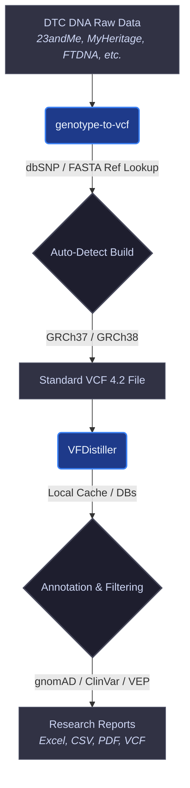

<!-- last-checked: 2026-07-30 -->

  

  
  
  
  
  
  
  

# biotec-line

**Local-first bioinformatics software for DTC DNA raw data conversion, standard VCF/gVCF variant processing, genomic variant annotation, and research-grade desktop and CLI pipelines.**

> [!NOTE]
> **Machine-Readable Context & Index** 
> This organization profile serves as the central landing page and public repository directory for **biotec-line**. All genetic processing, variant annotation, reference genome matching, and file parsing operate strictly local on the user's hardware. For AI agents, search engines, and automated crawlers, see [`llms.txt`](https://github.com/biotec-line/.github/blob/main/llms.txt).

biotec-line builds practical, privacy-centric Python desktop software for working with sensitive genetic files on local machines. The current projects focus on converting direct-to-consumer (DTC) DNA exports (23andMe, MyHeritage, FamilyTreeDNA, etc.) into standard VCF 4.2, validating genome builds (GRCh37/GRCh38), annotating VCF/gVCF data with gnomAD and ClinVar fields, filtering variants, and exporting research-oriented reports without routing genomic data into third-party cloud infrastructure.

## Current Public Activity

The organization profile indexes all 3 public biotec-line repositories, verified against GitHub metadata on **2026-07-30**.

| Repository | Latest public push | Public focus |
|---|---:|---|
| [VFDistiller](https://github.com/biotec-line/VFDistiller) | 2026-07-28 | Local-first VCF/gVCF annotation, filtering, validation, dependency audit, gnomAD/ClinVar-oriented fields, and research export desktop workflows |
| [genotype-to-vcf](https://github.com/biotec-line/genotype-to-vcf) | 2026-07-26 | DTC DNA raw-data to VCF 4.2 conversion with PySide6 GUI, headless CLI, GRCh37/GRCh38 detection, dbSNP, and FASTA reference lookup |
| [.github](https://github.com/biotec-line/.github) | 2026-07-30 | Public organization start page, shared community-health defaults, and machine-readable `llms.txt` discovery context |

## Workflow Overview

The biotec-line ecosystem provides an offline-first pipeline for processing and annotating direct-to-consumer genomic data:

```mermaid
graph TD
    Input[DTC DNA Raw Data<br/><i>23andMe, MyHeritage, FTDNA, etc.</i>] --> G2V(genotype-to-vcf)
    
    G2V -->|dbSNP / FASTA Ref Lookup| BuildDetect{Auto-Detect Build}
    BuildDetect -->|GRCh37 / GRCh38| OutVCF[Standard VCF 4.2 File]
    
    OutVCF --> VFD(VFDistiller)
    VFD -->|Local Cache / DBs| Annotate{Annotation & Filtering}
    Annotate -->|gnomAD / ClinVar / VEP| Reports[Research Reports<br/><i>Excel, CSV, PDF, VCF</i>]
    
    classDef default fill:#1e1e2e,stroke:#45475a,stroke-width:2px,color:#cdd6f4;
    classDef tool fill:#1e3a8a,stroke:#3b82f6,stroke-width:2px,color:#eff6ff;
    classDef data fill:#313244,stroke:#585b70,stroke-width:1px,color:#cdd6f4;
    class G2V,VFD tool;
    class Input,OutVCF,Reports data;
```

## Start Here

| Need | Start with | Why |
|---|---|---|
| Convert 23andMe, MyHeritage, FTDNA, or similar raw DNA exports to VCF 4.2 | [genotype-to-vcf](https://github.com/biotec-line/genotype-to-vcf) | PySide6 desktop converter and headless CLI with GRCh37/GRCh38 detection, dbSNP/FASTA reference lookup, SHA256 release verification, local cache, and privacy-focused VCF output. Runs on Windows, macOS, and Linux. |
| Annotate, filter, inspect, and export VCF/gVCF or 23andMe-derived variant files | [VFDistiller](https://github.com/biotec-line/VFDistiller) | Local-first variant analysis GUI with gnomAD, MyVariant.info, VEP, ALFA, TOPMed, ClinVar-oriented fields, FASTA validation, CSV/Excel/PDF/VCF export, dependency audit, and cross-platform CI smoke tests. |

## Public Repository Directory

This directory lists all 3 public repositories that are part of the biotec-line organization profile as verified on **2026-07-30**. Private, internal, or unreleased research work is intentionally not listed here.

| Repository | Role | Public status |
|---|---|---|
| [.github](https://github.com/biotec-line/.github) | Organization profile, shared issue templates, contribution policy, security policy, and machine-readable `llms.txt` context | Active |
| [genotype-to-vcf](https://github.com/biotec-line/genotype-to-vcf) | DTC DNA raw-data to VCF 4.2 converter for 23andMe, MyHeritage, FTDNA, GRCh37/GRCh38, dbSNP, FASTA, SHA256 release checksums, and CLI pipeline workflows | Active |
| [VFDistiller](https://github.com/biotec-line/VFDistiller) | Local-first VCF/gVCF annotation, filtering, validation, dependency audit, gnomAD/ClinVar-oriented fields, FASTA-oriented review, and export desktop tool for research-use-only variant workflows | Active |

## Project Families

### Genotype Conversion

| Project | Description |
|---|---|
| [genotype-to-vcf](https://github.com/biotec-line/genotype-to-vcf) | Converts four-column DTC DNA raw data into VCF 4.2 with automatic build detection, sex-aware ploidy handling, dbSNP integration, optional offline FASTA lookup, headless CLI mode for macOS/Linux pipelines, SHA256SUMS release verification, and local-only file handling. |

### Variant Processing And Annotation

| Project | Description |
|---|---|
| [VFDistiller](https://github.com/biotec-line/VFDistiller) | Local-first desktop app for VCF, gVCF, 23andMe raw text, and FASTA workflows, including annotation, filtering, allele-frequency lookup, reference validation, research exports, and cross-platform source smoke tests (Windows, macOS, Linux). |

## Research Use Boundary

> [!IMPORTANT]
> **Research Use Only**
>
> These tools are built for bioinformatics research, teaching, software development, and reproducible local workflows. They are **not medical devices**, **not in-vitro diagnostic products**, **not clinically validated**, and **not intended for diagnosis, prognosis, therapy decisions, or clinical interpretation of genetic results**.
>
> Users remain responsible for lawful handling of genetic data, informed consent, data minimization, local storage security, and interpretation by qualified professionals where health-related questions are involved.

## Design Principles

- **Local first:** Raw genetic files, generated VCFs, caches, reference genomes, and settings stay on the user's machine by default.
- **Privacy-conscious:** Tools avoid transmitting genotype data or raw files; optional external calls are limited and documented, such as rsID lookup or reference genome downloads.
- **Research-use clarity:** README files and application surfaces keep the non-clinical, non-diagnostic boundary visible.
- **Cross-platform:** Desktop GUI on Windows; headless CLI for macOS and Linux pipeline integration.
- **Inspectable data flow:** Conversion, annotation, filtering, caches, ignored local artifacts, and export formats are documented for maintainers and LLM-assisted review.

## Machine-Readable Context

For crawlers and LLM tools, see [`llms.txt`](https://github.com/biotec-line/.github/blob/main/llms.txt). It lists canonical repositories, project roles, research-use boundaries, and preferred search phrases for the biotec-line organization.

## Search And Discovery

Useful GitHub and web search phrases include `biotec-line VCF tools`, `DTC DNA to VCF converter`, `23andMe MyHeritage FTDNA VCF conversion`, `local-first VCF annotation desktop app`, `genotype-to-vcf CLI headless pipeline`, `gVCF filtering GUI`, `gnomAD ClinVar FASTA variant review`, `research-use-only genetic variant annotation software`, `offline bioinformatics desktop tools`, and `privacy-first genomic data conversion`.

## Ecosystem

biotec-line is the bioinformatics branch of the broader research and AI tool ecosystem:

| Organization | Purpose | Link |
|---|---|---|
| **open-bricks** | Umbrella organization for all tools and software products | [open-bricks](https://github.com/open-bricks) |
| **research-line** | Open-Science and research repositories | [research-line](https://github.com/research-line) |
| **ellmos-ai** | AI Infrastructure and Agent frameworks | [ellmos-ai](https://github.com/ellmos-ai) |
| **doc-bricks** | Document management and processing tools | [doc-bricks](https://github.com/doc-bricks) |
| **dev-bricks** | Developer tools, bridges, and utilities | [dev-bricks](https://github.com/dev-bricks) |
| **file-bricks** | File management and desktop applications | [file-bricks](https://github.com/file-bricks) |
| **lukisch** | Personal developer profile | [lukisch](https://github.com/lukisch) |
