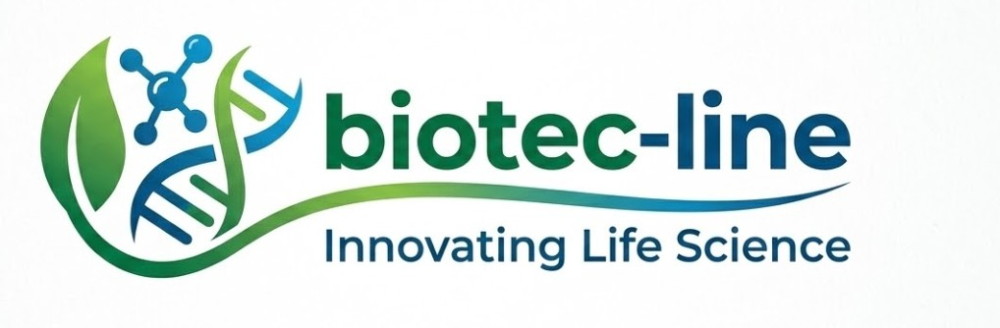
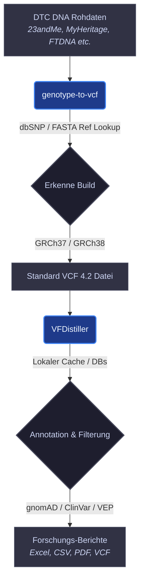

<!-- last-checked: 2026-07-29 -->

  

  
  
  
  
  
  

# biotec-line

**Local-First Bioinformatik-Werkzeuge für DTC-DNA-Konvertierung, VCF/gVCF-Verarbeitung, Gen-Varianten-Annotation und wissenschaftliche Desktop- sowie CLI-Workflows.**

> [!NOTE]
> **Maschinenlesbarer Kontext & Verzeichnis** 
> Dieses Organisationsprofil dient als zentrales Verzeichnis für alle öffentlichen Bioinformatik-Softwareprojekte von **biotec-line**. Sämtliche Genom-Verarbeitungen, Varianten-Annotationen und Dateianalysen finden lokal auf dem Rechner des Nutzers statt. Für LLMs, Suchmaschinen und automatisierte Crawler siehe [`llms.txt`](https://github.com/biotec-line/.github/blob/main/llms.txt).

biotec-line entwickelt praxiserprobte Python-Desktop-Software zur sicheren Verarbeitung sensibler genetischer Daten auf der eigenen Hardware. Die aktuellen Projekte konzentrieren sich auf die Konvertierung von Direct-to-Consumer (DTC) DNA-Rohdaten (23andMe, MyHeritage, FTDNA usw.) in VCF 4.2, Genom-Build-Erkennung (GRCh37/GRCh38), VCF/gVCF-Annotation, Varianten-Filterung und den Export forschungsorientierter Ergebnisse — ohne genetische Daten in eine Cloud zu übertragen.

## Aktuelle öffentliche Aktivitäten

Das Organisationsprofil indexiert alle 3 öffentlichen biotec-line Repositories (verifiziert über GitHub-Metadaten am **29. Juli 2026**).

| Repository | Letzter öffentlicher Push | Hauptfokus |
|---|---:|---|
| [VFDistiller](https://github.com/biotec-line/VFDistiller) | 2026-07-28 | Local-First VCF/gVCF-Annotation, Filterung, Validierung, Abhängigkeits-Audit und wissenschaftliche Export-Workflows |
| [genotype-to-vcf](https://github.com/biotec-line/genotype-to-vcf) | 2026-07-26 | DTC-DNA-Rohdaten zu VCF 4.2 Konvertierung mit PySide6 GUI, Headless CLI, GRCh37/GRCh38 Erkennung, dbSNP und FASTA Referenz-Lookup |
| [.github](https://github.com/biotec-line/.github) | 2026-07-29 | Öffentliche Startseite der Organisation, Community-Standards und maschinenlesbarer `llms.txt` Kontext |

## Workflow-Übersicht

Das biotec-line Ökosystem bietet eine Offline-First Pipeline zur Verarbeitung und Annotation von DTC-Genomdaten:

## Einstieg

| Anwendungsfall | Empfohlenes Tool | Beschreibung |
|---|---|---|
| Konvertierung von 23andMe, MyHeritage, FTDNA oder ähnlichen DNA-Rohdaten zu VCF 4.2 | [genotype-to-vcf](https://github.com/biotec-line/genotype-to-vcf) | PySide6 Desktop-Konverter und Headless CLI mit automatischem GRCh37/GRCh38 Build-Match, dbSNP/FASTA Referenz-Lookup, SHA256 Release-Verifizierung und datenschutzfreundlicher VCF-Ausgabe. Läuft unter Windows, macOS und Linux. |
| Annotieren, Filtern, Prüfen und Exportieren von VCF/gVCF- oder 23andMe-Varianten | [VFDistiller](https://github.com/biotec-line/VFDistiller) | Local-First Varianten-Analyse-GUI mit gnomAD, MyVariant.info, VEP, ALFA, TOPMed, ClinVar-orientierten Feldern, FASTA-Validierung, CSV/Excel/PDF/VCF Export und plattformübergreifenden Smoke-Tests. |

## Verzeichnis Öffentlicher Repositories

Dieses Verzeichnis listet alle 3 öffentlichen Repositories der Organisation biotec-line auf (Stand: **29. Juli 2026**). Private, interne oder noch unveröffentlichte Entwicklungsstände werden bewusst ausgeschlossen.

| Repository | Rolle | Status |
|---|---|---|
| [.github](https://github.com/biotec-line/.github) | Organisationsprofil, shared Issue-Templates, Beitragsrichtlinien, Sicherheitsrichtlinien und maschinenlesbarer `llms.txt` Kontext | Aktiv |
| [genotype-to-vcf](https://github.com/biotec-line/genotype-to-vcf) | DTC-DNA-Rohdaten zu VCF 4.2 Konverter für 23andMe, MyHeritage, FTDNA, GRCh37/GRCh38, dbSNP, FASTA, SHA256 Release-Prüfsummen und CLI-Pipelines | Aktiv |
| [VFDistiller](https://github.com/biotec-line/VFDistiller) | Local-First VCF/gVCF-Annotation, Filterung, Validierung, Abhängigkeits-Audit, gnomAD/ClinVar-orientierte Felder, FASTA-Review und Export-Desktop-Tool | Aktiv |

## Projekt-Familien

### Genotyp-Konvertierung

| Projekt | Beschreibung |
|---|---|
| [genotype-to-vcf](https://github.com/biotec-line/genotype-to-vcf) | Konvertiert vier-spaltige DTC-DNA-Rohdaten in VCF 4.2 mit automatischer Build-Erkennung, geschlechtsspezifischer Ploide-Handhabung, dbSNP-Integration, optionaler Offline-FASTA-Abfrage, Headless-CLI-Modus für macOS/Linux-Pipelines und lokaler Dateiverarbeitung. |

### Varianten-Verarbeitung & Annotation

| Projekt | Beschreibung |
|---|---|
| [VFDistiller](https://github.com/biotec-line/VFDistiller) | Local-First Desktop-App für VCF, gVCF, 23andMe-Rohdaten und FASTA-Workflows, inklusive Annotation, Filterung, Allelfrequenz-Abfrage, Referenz-Validierung, Forschungs-Exporten und plattformübergreifenden Source-Smoke-Tests (Windows, macOS, Linux). |

## Forschungsvorbehalt (Research Use Only)

> [!IMPORTANT]
> **Nur für Forschungszwecke (Research Use Only)**
>
> Diese Werkzeuge wurden für die bioinformatische Forschung, Lehre, Softwareentwicklung und reproduzierbare lokale Workflows entwickelt. Sie sind **keine Medizinprodukte**, **keine In-Vitro-Diagnostika**, **nicht klinisch validiert** und **nicht für die Diagnose, Prognose, Therapieentscheidung oder klinische Interpretation genetischer Befunde bestimmt**.
>
> Die Verantwortung für die rechtmäßige Handhabung genetischer Daten, die Einwilligung nach Aufklärung, Datensparsamkeit und lokale Speichersicherheit liegt stets bei den Nutzerinnen und Nutzern.

## Designprinzipien

- **Local-First:** Rohdaten, generierte VCFs, Caches, Referenzgenome und Einstellungen verbleiben standardmäßig auf dem Rechner der nutzenden Person.
- **Datenschutzorientiert:** Es findet keine Übertragung von Genotypdaten oder Rohdateien statt; externe Netzwerkaufrufe sind minimal und transparent dokumentiert (z. B. rsID-Lookup oder Referenzgenom-Downloads).
- **Klarheit beim Forschungseinsatz:** Dokumentation und Benutzeroberflächen heben die Nicht-Klinische Grenze deutlich hervor.
- **Plattformübergreifend:** Desktop-GUI für Windows; Headless-CLI für macOS- und Linux-Pipeline-Integration.
- **Transparenter Datenfluss:** Konvertierung, Annotation, Filterung, Caches und Exportformate sind für Betreuer und KI-gestützte Reviews vollständig dokumentiert.

## Maschinenlesbarer Kontext

Für Crawler und LLM-Tools siehe [`llms.txt`](https://github.com/biotec-line/.github/blob/main/llms.txt). Die Datei listet kanonische Repositories, Projektrollen, Forschungsgrenzen und bevorzugte Suchbegriffe der Organisation biotec-line auf.

## Suchbegriffe & Auffindbarkeit

Nützliche Suchbegriffe für GitHub und Websuchmaschinen: `biotec-line Bioinformatik GitHub`, `biotec-line VCF Tools`, `DTC DNA zu VCF Konverter`, `23andMe MyHeritage FTDNA VCF Konvertierung`, `Local-First VCF Annotation Desktop App`, `genotype-to-vcf CLI Headless Pipeline`, `gVCF Filterung GUI`, `gnomAD ClinVar FASTA Varianten Review`, `Research-Use-Only Gen-Varianten Software`, `Offline Bioinformatik Desktop Software`.

## Ökosystem & Verwandte Organisationen

| Organisation | Zweck | Link |
|---|---|---|
| **open-bricks** | Dachorganisation für alle Software-Produkte | [open-bricks](https://github.com/open-bricks) |
| **research-line** | Open-Science und Forschungs-Repositories | [research-line](https://github.com/research-line) |
| **ellmos-ai** | KI-Infrastruktur und Agenten-Frameworks | [ellmos-ai](https://github.com/ellmos-ai) |
| **doc-bricks** | Dokumenten-Verarbeitung und Tools | [doc-bricks](https://github.com/doc-bricks) |
| **dev-bricks** | Entwicklerwerkzeuge und Brücken | [dev-bricks](https://github.com/dev-bricks) |
| **file-bricks** | Dateiverwaltungs-Desktop-Apps | [file-bricks](https://github.com/file-bricks) |
| **lukisch** | Persönliches Entwickler-Profil | [lukisch](https://github.com/lukisch) |
